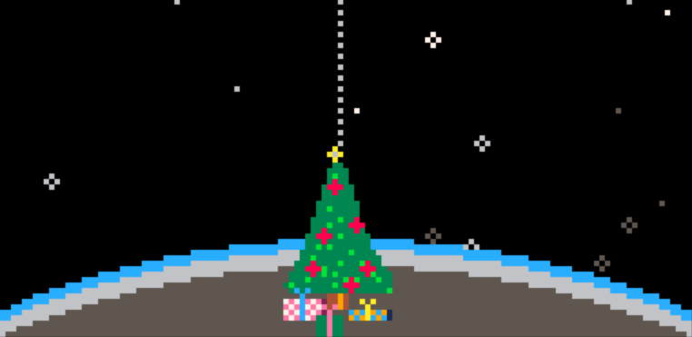
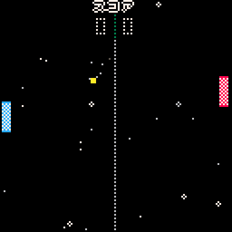
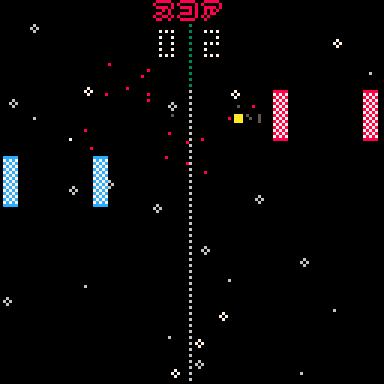
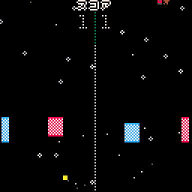
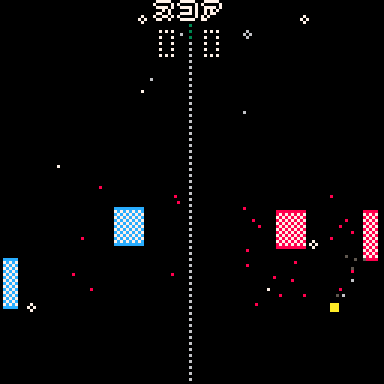

# **Xmas P8ng**
This is a Pico-8 game originally published on November 14, 2024.  
The game is a Pong clone. The goal of this project was to create a simple game with new modes and a Christmas theme. I tried to make it as beautiful as possible and put effort into some graphic effects.  
Of course, the game adheres to Pico-8's restrictions, striving to use the fewest possible characters and tokens. I can't say I'm not proud of squeezing it into 27,406 characters while maintaining readability—because I am.  
You can play this game locally (if you have Pico-8 installed) or online at Lexaloffle.  

***

It's Christmas time! It's time to gather with family and friends.  
Amidst the delicious holiday food and drinks, enjoy a fun game of Pong.  
If you haven't been left Home Alone, it's time to battle through some thrilling matches. But we all know old habits die hard, so remember to brush your teeth before bed and avoid arguing with your friends over the game—so Santa can bring you a gift too. 🎅🎁  

## Controls  

You can choose to play on the right (P1) or left (P2).  

Configure the players on the main screen.  
⬅️⬆️ - Move paddle up  
➡️⬇️ - Move paddle down  
[z] [x] - Confirm  

You can also use Pico-8's second-player controller scheme:  
[s] [e] - Move paddle up  
[f] [d] - Move paddle down  
[q] [w] - Confirm  

## Rules  
**Objective**: Hit the ball past your opponent’s paddle to score points.  
**Gameplay**: Players control paddles that move vertically. The ball bounces off paddles and upper walls.  
**Scoring**: A point is scored when the opponent misses the ball. The game continues until time runs out.  
**Serve**: The ball starts in the center and is served automatically after each point.  
  
## Game Modes  
### **P1 vs P2**
Regular P8ng, the game you already know and love since the year Garfield was born.  

### **Soccer**
Control the goalkeeper and the defender simultaneously. Be careful not to score an own goal!  

### **SubP8ng**
Control two paddles at the same time, but your opponent is on your side of the court. Interesting subgames can happen.  

### **FreeFly**
The final challenge. Use all your skills to control both your paddles, but attackers are free to fly.  

  
## Credits
Leandro Pereira

## Remarks  
This game is a variation of P8ng2024, previously published on [Lexaloffl](https://www.lexaloffle.com/bbs/?tid=144711). It includes bug fixes, code improvements and several changes to make the game more enjoyable.  
If you have any feedback or suggestions for improvement, I would be very happy to hear them. Have a Merry Christmas, and if it's not a holiday you celebrate, I still wish you great happiness.  

Have fun! :)🎄 🎮

## License  
This work is licensed under a [Creative Commons Attribution-NonCommercial 4.0 International License](https://www.creativecommons.org/licenses/by-nc/4.0/deed.en).  
  

You are free to share, adapt but **do not use it for commercial purposes**.  

## FAQ
- **Does the game works on a mobile devices?**  
Yes, It actually does.  

- **Can I use my gamepad?**  
Hell yeah! 🚀 If your gamepad is supported by Pico-8, you can use it to play Xmas P8ng without any issues. Just make sure it's properly configured in Pico-8's settings. If you're using a USB gamepad, Pico-8 usually detects it automatically. For Bluetooth controllers, check if your device is paired before launching the game.  

- **Are you planning new versions of this game?**  
I consider this project complete, so I don't plan any new versions. However I will fix any bug if they are found  

## Links  
- [Pico-8 Documentation](https://www.lexaloffle.com/pico-8.php)  
- [Original post](https://www.lexaloffle.com/bbs/?tid=145318)  
